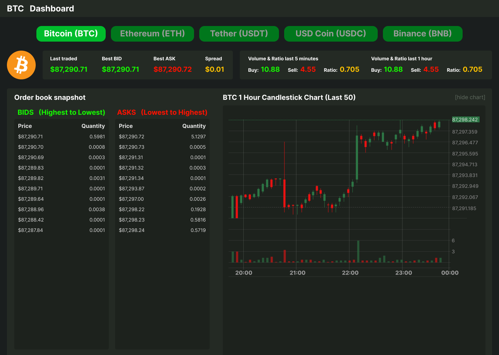

# Crypto Dashboard

A real-time cryptocurrency dashboard built with Python and Tkinter. Displays live market data from Binance, including price tickers, volume, order book, recent trades, and candlestick charts. Supports multiple cryptocurrencies with toggleable panels and saved preferences.

## Project Structure

```bash
cryptocurrency/
├── lib/                # Panels and utilities
│ ├── **init**.py
│ ├── ticker.py         # CryptoTicker panel
│ ├── volume.py         # 24h Volume panel
│ ├── orderbook.py      # OrderBookPanel
│ ├── last_trade.py     # LastTradePanel
│ ├── chart.py          # Candlestick chart panel
│ ├── debug.py          # Logging utility
│ ├── base_panel.py     # Base panel for Tkinter panels
│ └── base.py           # Base panel for WebSocket panels
└── media/              # Entry point, main dashboard
│ └── ui_design_01.png  # Figma UI Design
├── main.py             # Entry point, main dashboard
├── requirements.txt    # All required dependencies
└── README.md           # This file
```

## Features

### Core Features

- Real-time price tracking for multiple cryptocurrencies (BTC, ETH, SOL, BNB, XRP, USDC)
- Color-coded price changes (green for positive, red for negative)
- 24-hour price change display
- Clean, organized, professional GUI
- Toggle buttons to show/hide panels
- Responsive layout that adapts to window resizing
- Persistent settings (last selected symbol and panel visibility)

### Advanced Features

- 24-hour volume display
- Order book showing top 10 bids and asks
- Recent trades feed
- Candlestick chart with volume using Matplotlib
- Multiple panels displaying different market information
- Efficient use of screen space

## Installation

### Requirements

- Python 3.7+

- Dependencies (install via pip):

```
pip install -r requirements.txt
```

### Clone the Repository

```
git clone https://github.com/CYRTRUS/cryptocurrency.git
cd cryptocurrency
```

## Usage

### Run the main application:

```
python main.py
```

- Click cryptocurrency buttons to switch Crypto.

- Toggle OrderBook or Chart panels using the yellow buttons.

- Settings are automatically saved on exit.

## The First Figma UI Design



## Demonstrate Video

[](https://youtu.be/myqGtr6JDUs)

## Project Requirements & Grading Rubric

### Core Requirements

#### Basic Features

1. Basic Functionality

- ✅ Application launches without errors
- ✅ Clean OOP design with classes
- ✅ Proper event handling
- ✅ Graceful shutdown (closes WebSockets, no errors)

2. Price Tickers

- ✅ At least 3 cryptocurrency tickers (BTC, ETH, SOL)
- ✅ Real-time price updates via WebSocket
- ✅ Color-coded price changes (green/red)
- ✅ Display 24h change and percentage

3. User Interface

- ✅ Professional, organized layout
- ✅ Toggle buttons to show/hide panels
- ✅ Responsive to window resizing
- ✅ Clear labeling and readability

#### Advanced Features

4. Additional Data Streams

- ✅ 24-Hour Volume display
- ✅ Order Book (top 10 bids/asks)
- ✅ Recent Trades feed
- ✅ Candlestick chart with matplotlib

5. Multiple Assets & Toggles

- ✅ Support for 5+ cryptocurrencies
- ✅ Individual toggle buttons for each asset
- ✅ Saved preferences (remember which panels are visible)

6. Information Density

- ✅ Displays comprehensive market data
- ✅ Multiple panels with different information types
- ✅ Efficient use of screen space
